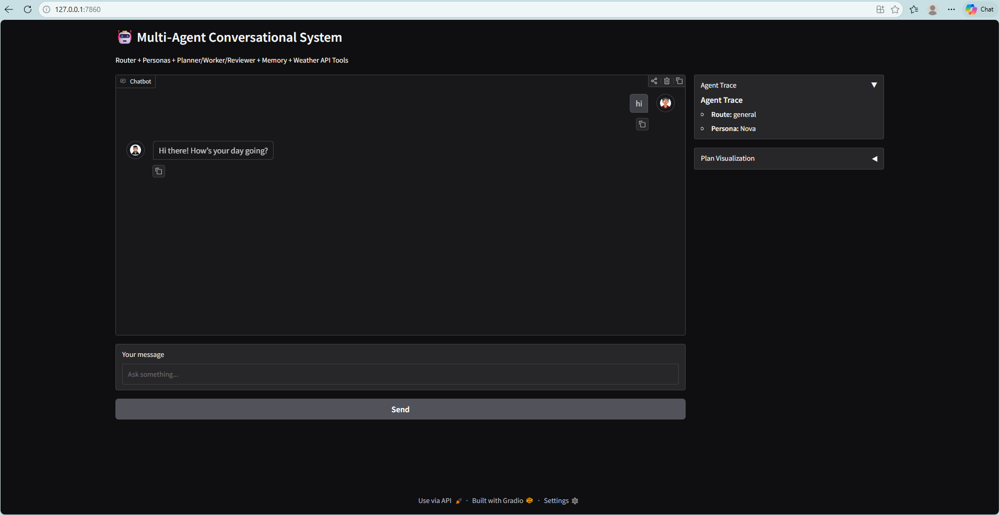

# Multi Agent Chatbot

The goal of this exercise is to design and implement an multi agent AI system with a conversational interface.

The features of this chatbot include:

* Persona based agents
* Router agent for content based routing
* Math agent for math problem Solving
* Programming Code Writer Agent
* General Query Agent
* External Weather API Call Agent
* Planner → Worker → Reviewer Multi-Agent Chain
* Short-term Memory to the State for Multi‑turn Conversations
* Agent Tracing
* Plan Visualization
* Avatars

## Services

* This implementation is based on LangGraph's tools i.e. Agentic AI design pattern.
* The file main.py contains the llm model calls and agents definitions.
* Weather tool is in the files tools_current_weather.py.
* Weather tool is imported to main.

### Service : API Call (Weather API)

* This API call service is implemented in tools_current_weather.py file.
* In this service API call is made to publicly available weather service.
* Update the value of 'API_GATEWAY_KEY' property in '/path/to/multi-agent-conversational-system/.secrets' file.
* We need to go to 'weatherstack.com', create a free account, and obtain the access key.
* Add 'WEATHERSTACK_ACCESS_KEY' property in '/path/to/multi-agent-conversational-system/.secrets' file, and set it's value with the access key obtained from 'weatherstack.com'.

## User Interface

+ Added conversational style.
+ Implemented in Gradio in 'app.py' file.
+ Implemented a memory management system for short-term memory.

---

## Running Chatbot Application

* cd '/path/to/multi-agent-conversational-system'
* python -m multi_agent_chatbot.app
* Or running start-app.sh script
* Once the appis up and running, go to 'http://127.0.0.1:7860/' in a browser of your choice.

## Example Run

